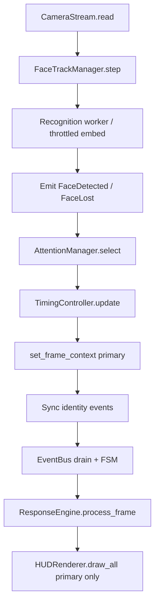

# Recognition pipeline

Each frame in `main.update_camera()` follows this order:

## Perception

1. **Detection** — Haar cascade + validation (`face_detection.detect_faces`).
2. **Tracking** — IoU/centroid association, KCF/CSRT per track, duplicate identity pruning.
3. **Recognition** — ArcFace embedding, temporal vote, identity lock (`recognition.py`).
4. **Emotion** — DeepFace emotion model, throttled per track (`user_emotion.py`).

## Events

Perception emits events only; it does not update the HUD directly.

- `FaceDetected` / `FaceLost` — track lifecycle
- `FaceRecognized` / `UnknownFaceDetected` — stable identity
- `EmotionUpdated` — feeling row on HUD
- `AttentionShifted` — primary face changed

## AI core

- **StateMachine** — `IDLE`, `DETECTING`, `RECOGNIZED`, `UNKNOWN`, `ALERT`, `ENGAGED`
- **ResponseEngine** — greetings, TTS, memory, multi-step sequences
- **Throttler** — prevents repeated greetings and voice spam

Only the **primary** attention target triggers full greet sequences.

## Performance defaults

- Process resolution: 960×540
- Async recognition worker
- Locked identity: re-run recognition less often
- Primary-only HUD drawing
